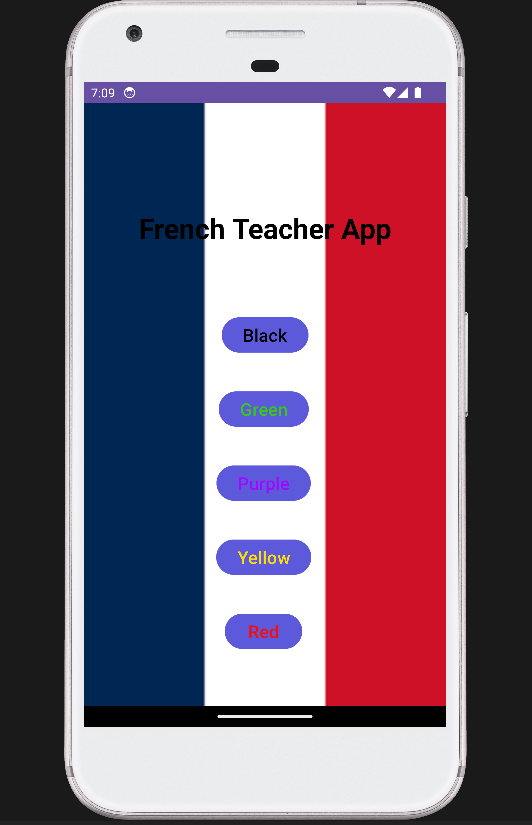

# French Teacher

A simple Android app that helps users learn French color names with audio pronunciation.

## Download APK

⬇️ Download the latest APK from the Releases section:

https://github.com/Jayant134/French-Teacher/releases/download/v1/app-debug.apk

## Screenshot

## How to Run

1. Download the APK from the link above.
2. Install it on your Android device.
3. Open the app and tap a color button to hear its French pronunciation.

## Author

Jayant Tiwari
